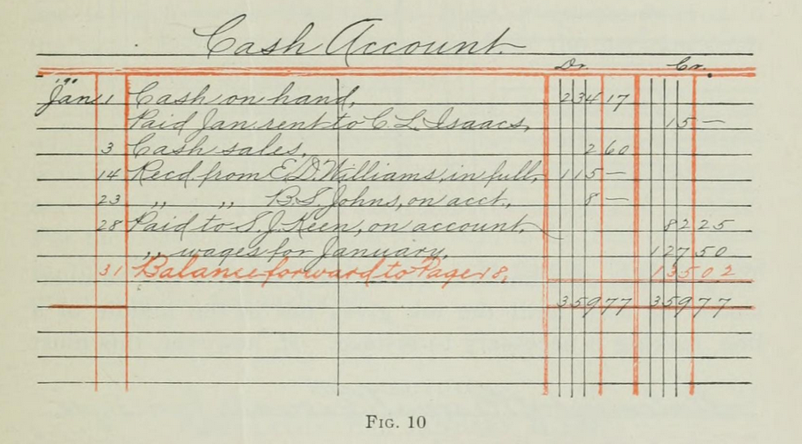

# Getting started

1. Clone this repository.
2. Have PostgreSQL installed.
3. Update `appsettings.json`.`DatabasePassword`.
4. Set `database-reset.json`.`Reset` to `true`.
5. Run the application.

## Model any financial operation

1. Create Invoice
2. Receive Payment
3. Record Foreign Currency Transaction
4. Issue or Assign Equity (e.g., owner’s capital, shares issued)
5. Purchase Inventory
6. Move Inventory Between Locations
7. Record Expense Payment (e.g., rent, utilities)
8. Record Payroll
9. Record Depreciation of Assets
10. Accrue Liabilities (e.g., taxes payable, interest payable)

## How it works

Core concepts:

* Journal - chronological record of all financial transactions good enough to satisfy an audit.
	* Double-entry - method for recording journal entries.
	* Forward-only - rule that dictates journal entries cannot be modified or deleted.
* Accounts - chart of accounts.
* Transaction - grouping of multiple journal entries.

### Journal, Chart of Accounts, and Transactions

```markdown
| Date       | Account               | Debit | Credit |
|------------|-----------------------|-------|--------|
| 2024-06-20 | Accounts Receivable   | 55    |        |
| 2024-06-20 | Sales Revenue         |       | 50     |
| 2024-06-20 | Sales Tax             |       | 5      |
```

```markdown
| Account    | Debit    | Credit   |
|------------|----------|----------|
| Asset      | Increase | Decrease |
| Liability  | Decrease | Increase |
| Equity     | Decrease | Increase |
| Revenue    | Decrease | Increase |
| Expense    | Increase | Decrease |
```

### Double-entry and forward-only

The system prevents journal entries from being modified or deleted by not implementing such functionality.

```cs
public int Update(Journal entity)
{
  throw new NotImplementedException();
}

public int Delete(int id)
{
  throw new NotImplementedException();
}
```

## Implemented examples

* Creating invoice
* Receiving payment
* Reconciliations